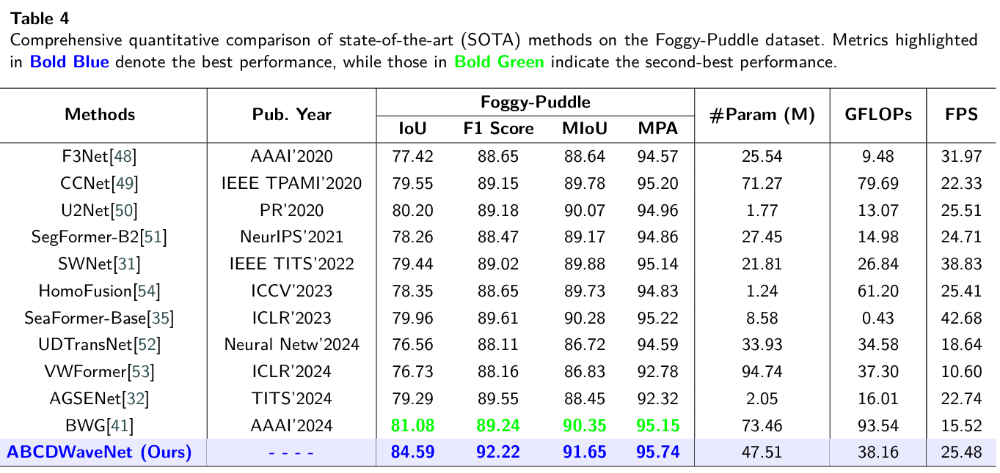
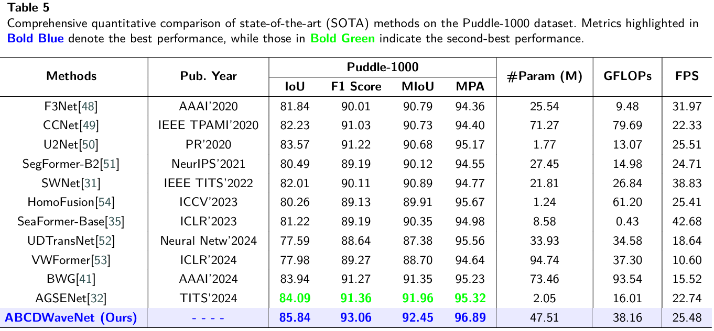
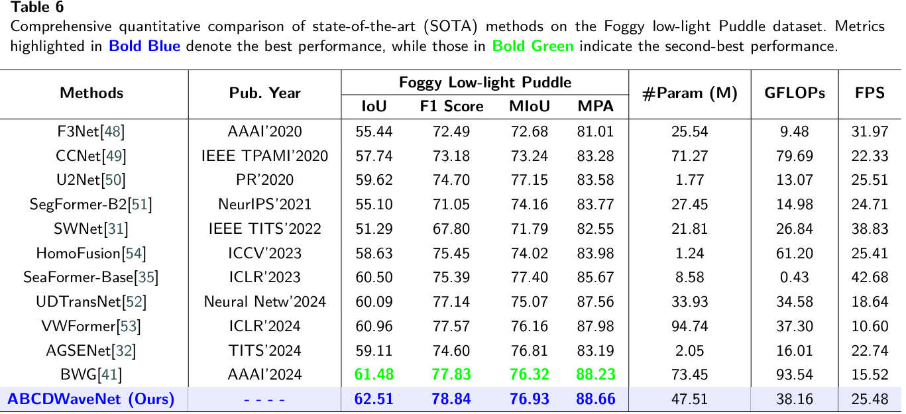

# ABCDWaveNet: Advancing Robust Road Ponding Detection in Fog through Dynamic Frequency-Spatial Synergy

Ronghui Zhang, Dakang Lyu, Benfei Wang, Junzhou Chen, Tengfei Li, Bolin Gao, Yunfan Wu, Ujjal MANANDHAR, Danwei Wang and Yiqiu Tan

---
## Abstract
Road ponding presents a significant threat to vehicle safety, particularly in adverse fog conditions,
where reliable detection remains a persistent challenge for Advanced Driving Assistance Systems
(ADAS). To address this, we propose ABCDWaveNet, a novel deep learning framework leveraging
Dynamic Frequency-Spatial Synergy for robust ponding detection in fog. The core of ABCDWaveNet
achieves this synergy by integrating dynamic convolution for adaptive feature extraction across vary-
ing visibilities with a wavelet-based module for synergistic frequency-spatial feature enhancement,
significantly improving robustness against fog interference. Building on this foundation, ABCD-
WaveNet captures multi-scale structural and contextual information, subsequently employing an
Adaptive Attention Coupling Gate (AACG) to adaptively fuse global and local features for enhanced
accuracy. To facilitate realistic evaluations under combined adverse conditions, we introduce the
Foggy Low-Light Puddle dataset. Extensive experiments demonstrate that ABCDWaveNet establishes
new state-of-the-art performance, achieving significant Intersection over Union (IoU) gains of 3.51%,
1.75%, and 1.03% on the Foggy-Puddle, Puddle-1000, and our Foggy Low-Light Puddle datasets,
respectively. Furthermore, its processing speed of 25.48 FPS on an NVIDIA Jetson AGX Orin
confirms its suitability for ADAS deployment. These findings underscore the effectiveness of the
proposed Dynamic Frequency-Spatial Synergy within ABCDWaveNet, offering valuable insights
for developing proactive road safety solutions capable of operating reliably in challenging weather
conditions.

---

## Method


---

## Datasets

- **Puddle-1000**: Standard road ponding detection dataset.  
- **Foggy-Puddle**: Synthetic foggy weather dataset based on Puddle-1000.  
- **Foggy Low-Light Puddle**: A novel benchmark simulating combined foggy and low-light conditions.

Please download and place the datasets under the `data` directory.

---
## Results







---

## Environment & Dependencies

- Python >= 3.8  
- PyTorch >= 1.10  
- CUDA >= 11.0  
- Other dependencies listed in `requirements.txt`

Install dependencies with:

```bash
pip install -r requirements.txt
Quick Start
Clone the Repository
git clone https://github.com/Lyu-Dakang/ABCDWaveNet.git
cd ABCDWaveNet
Training
Ensure datasets are correctly placed, then run:
python train.py 
```
---


## Contact

For questions or suggestions, please contact: lvdk@mail2.sysu.edu.cn

---

## Citation

Ronghui Zhang, Dakang Lyu, Benfei Wang, Junzhou Chen, Tengfei Li, Bolin Gao, Yunfan Wu, Ujjal Manandhar, Danwei Wang, and Yiqiu Tan.
ABCDWaveNet: Advancing Robust Road Ponding Detection in Fog through Dynamic Frequency-Spatial Synergy.
Submitted to Engineering, 2025.
arXiv preprint arXiv:2504.05112, https://arxiv.org/abs/2504.05112.